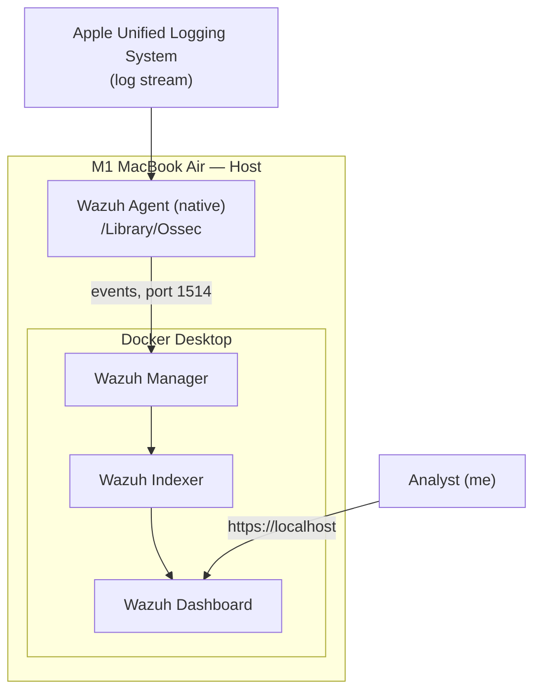
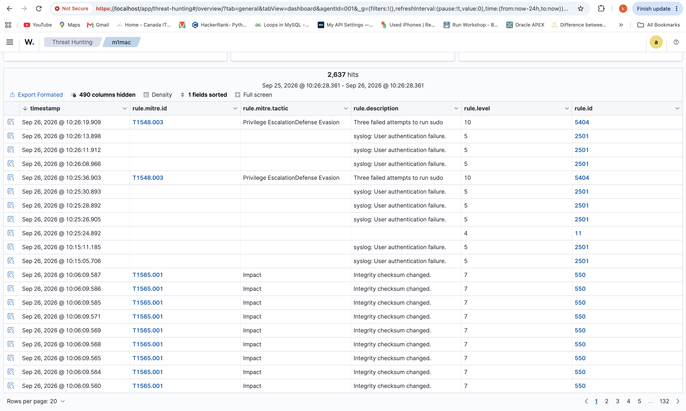
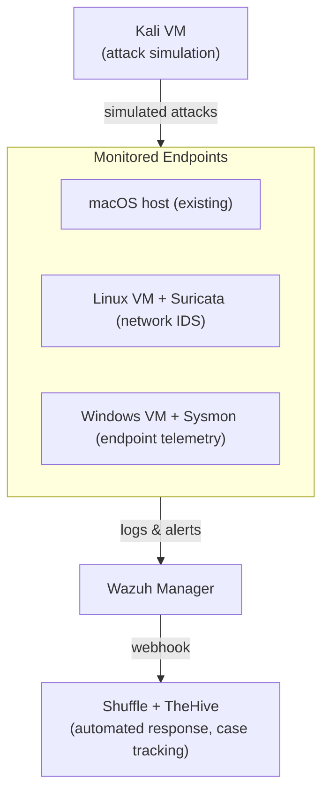

# Wazuh SIEM Home Lab — macOS Edition

**A self-hosted SIEM deployment built to demonstrate hands-on detection engineering and incident troubleshooting, targeting SOC Analyst roles.**

> TL;DR: I deployed Wazuh (Docker) on an Apple Silicon Mac, then discovered macOS doesn't log authentication failures the way every Wazuh tutorial assumes. Fixing that required understanding Apple's Unified Logging System, its privacy redaction model, and Wazuh's log-collection internals well enough to build a working fix from scratch — then validate it produced a real, correctly-escalated alert. Keeping it running turned out to be its own lesson: most of the "it broke" moments after that were networking and infrastructure, not detection logic.

---

## Table of Contents

- [Overview](#overview)
- [Architecture](#architecture)
- [Tech Stack](#tech-stack)
- [The Objective](#the-objective)
- [Roadblocks & How I Solved Them](#roadblocks--how-i-solved-them)
- [Validated Detection — Case Study](#validated-detection--case-study)
- [Key Lessons Learned](#key-lessons-learned)
- [Skills Demonstrated](#skills-demonstrated)
- [Roadmap — Planned Expansion](#roadmap--planned-expansion)
- [Repository Structure](#repository-structure)
- [Setup Notes](#setup-notes)

---

## Overview

This project is a single-node [Wazuh](https://wazuh.com/) SIEM deployment running in Docker on an M1 MacBook Air, with a native Wazuh agent monitoring the Mac itself as an endpoint.

Most public Wazuh walkthroughs are written for Linux or Windows targets, where authentication logging is either a flat text file (`/var/log/auth.log`) or the Windows Event Log — both of which Wazuh's default ruleset already understands. Monitoring **macOS** turned out to be a meaningfully different problem: no flat auth log exists, the logging subsystem redacts the exact fields a SIEM needs, and the default agent configuration silently fails in a way that looks like "it's just not logging much" rather than throwing an obvious error.

This README documents the deployment, every roadblock encountered getting real detections working — and staying working — with the reasoning behind each fix, not just the final commands. If you're evaluating this as a portfolio piece: the interesting part isn't that Wazuh is running, it's *why it kept breaking* and how each cause was actually diagnosed rather than guessed at.

---

## Architecture

**Current state:**



The manager, indexer, and dashboard run as three containers via the official `wazuh-docker` single-node `docker-compose.yml`. The agent runs **natively** on macOS (not containerized — Wazuh agents monitor the host they're installed on, so it has to sit outside Docker to see the real OS).

---

## Tech Stack

| Component | Role |
|---|---|
| Wazuh Manager / Indexer / Dashboard (Docker, single-node, v4.9.0) | SIEM core — log ingestion, rule correlation, storage, visualization |
| Wazuh Agent (native macOS install) | Endpoint telemetry collection |
| Apple Unified Logging System (ULS) | macOS's system log source, accessed via the `log` CLI |
| Docker Desktop (Apple Silicon) | Container runtime for the SIEM stack |

---

## The Objective

Start with a foundational, provable detection before adding scope: **reliably detect and alert on failed `sudo` authentication attempts** on the monitored macOS host. This is the "hello world" of host-based detection — if this doesn't work, nothing downstream will.

---

## Roadblocks & How I Solved Them

### Roadblock 1 — Agent enrolled against `127.0.0.1` instead of the host's real IP

**Symptom:** During agent deployment, the Wazuh dashboard's "Deploy new agent" wizard was pointed at `127.0.0.1` for the manager address.

**Why it's a problem:** Because the agent runs on the same Mac as Docker Desktop, `127.0.0.1` can *appear* to work — Docker Desktop forwards published container ports (`1514`/`1515`) onto the host's loopback interface too. But Wazuh's own deployment documentation explicitly calls for the Docker host's real LAN IP, not loopback or the container's internal address, because it breaks immediately for any other device added to the lab later — those machines can't reach "themselves" at `127.0.0.1`.

**Fix (at the time):**
```bash
ipconfig getifaddr en0                          # get the Mac's LAN IP
sudo nano /Library/Ossec/etc/ossec.conf         # update <address> under <client><server>
sudo /Library/Ossec/bin/wazuh-control restart
```

**Lesson:** "it works" and "it's correctly configured" aren't the same thing. (This one gets revisited — see **Roadblock 5**.)

---

### Roadblock 2 — sudo failures never showed up; only generic "major events"

This was the core problem, and it took several layers of investigation to fully resolve.

#### 2a. macOS doesn't have a flat auth log

Every Linux-oriented Wazuh guide assumes `/var/log/auth.log` or similar. macOS has no such file — authentication and system events instead flow through the **Unified Logging System (ULS)**, queried via the `log` command-line tool, not a plain text file Wazuh can tail.

#### 2b. The existing agent config used the wrong collection method

The agent's `ossec.conf` had this block already in place:

```xml
<localfile>
    <log_format>command</log_format>
    <command>log show --predicate 'process == "sudo"' --last 1m --style compact | grep -i "incorrect"</command>
    <alias>macos-sudo-failures</alias>
    <frequency>60</frequency>
</localfile>
```

This *polls* `log show` every 60 seconds and greps for a guessed keyword. Two problems:
1. Wazuh's built-in decoders and rules for macOS (added in 4.4.2+) only recognize output from the **native** `log_format=macos` collector — a `command`-type block's output is unstructured text that never gets decoded, so even a real match just shows up as generic command output, not a classified alert.
2. `grep -i "incorrect"` was a guess at wording that didn't reliably match the actual failure text.

**Fix — switch to native log collection:**

```xml
<localfile>
  <location>macos</location>
  <log_format>macos</log_format>
  <query type="trace,log,activity" level="info">
    (process == "sudo") or
    (process == "opendirectoryd" and eventMessage contains "Authentication failed for" and subsystem == "com.apple.opendirectoryd") or
    (process == "sshd")
  </query>
</localfile>
```

Wazuh translates this `<query>` block internally into a real `log stream --style syslog ...` process, whose output its decoders are actually built to parse.

#### 2c. Apple redacts the exact fields a SIEM needs

Even with native collection in place, macOS's Unified Logging redacts privacy-sensitive fields (usernames, hostnames) by default, replacing them with a literal `<private>` placeholder. Since macOS Mojave this is on by default system-wide, and it specifically affects authentication messages from `opendirectoryd` — the daemon that verifies local account passwords, including the one `sudo` calls.

**Fix — a scoped configuration profile to unlock private logging for just that subsystem:**

<details>
<summary>EnablePrivateData.mobileconfig (click to expand)</summary>

```xml
<?xml version="1.0" encoding="UTF-8"?>
<!DOCTYPE plist PUBLIC "-//Apple//DTD PLIST 1.0//EN" "http://www.apple.com/DTDs/PropertyList-1.0.dtd">
<plist version="1.0">
<dict>
  <key>PayloadContent</key>
  <array>
    <dict>
      <key>PayloadDisplayName</key><string>Unified Logging - Private Data</string>
      <key>PayloadEnabled</key><true/>
      <key>PayloadIdentifier</key><string>com.homelab.logging.privatedata</string>
      <key>PayloadType</key><string>com.apple.system.logging</string>
      <key>PayloadUUID</key><string>REPLACE-WITH-UUIDGEN-OUTPUT-1</string>
      <key>PayloadVersion</key><integer>1</integer>
      <key>Subsystems</key>
      <dict>
        <key>com.apple.opendirectoryd</key>
        <dict>
          <key>DEFAULT-OPTIONS</key>
          <dict><key>Enable-Private-Data</key><true/></dict>
        </dict>
      </dict>
    </dict>
  </array>
  <key>PayloadDisplayName</key><string>Homelab - Enable Private Auth Logging</string>
  <key>PayloadIdentifier</key><string>com.homelab.logging.profile</string>
  <key>PayloadScope</key><string>System</string>
  <key>PayloadType</key><string>Configuration</string>
  <key>PayloadUUID</key><string>REPLACE-WITH-UUIDGEN-OUTPUT-2</string>
  <key>PayloadVersion</key><integer>1</integer>
</dict>
</plist>
```

</details>

This is a genuine, first-party Apple mechanism (`com.apple.system.logging` payload type) — not a workaround or a hack. It's deliberately scoped to a single subsystem rather than disabling redaction system-wide, which matters both for security hygiene and for demonstrating least-privilege thinking.

Installed by double-clicking the generated `.mobileconfig` and approving it under **System Settings → Privacy & Security**.

#### 2d. Permission roadblocks while editing the config

Editing `/Library/Ossec/etc/ossec.conf` directly surfaced a couple of standard macOS friction points, worth documenting because they're easy to misdiagnose as something more serious:
- The file is root-owned — both **reading** it (`grep`) and **writing** it require `sudo`, not just writing.
- `vi`'s modal editing (`i` to insert, `Esc` then `:wq` to save and quit) is an easy place to get stuck if you're not used to it — switching to `nano` removed that friction entirely.

**Lesson:** most "config isn't working" problems on macOS resolve to one of three things — wrong collection method, privacy redaction, or a permissions/tooling gap. Ruling those out in order avoids chasing the wrong fix.

---

### Roadblock 3 — the dashboard said nothing was happening (it was lying by omission)

After deploying the fix and triggering a deliberate failed `sudo` attempt, the Wazuh **Dashboard** tab's "Authentication failure" summary tile still read **0**.

**Investigation:** two separate red herrings:
1. **Time window.** The dashboard's date range had a fixed end time from earlier in the day — any event generated after that point simply wasn't in view.
2. **The wrong widget.** That specific "Authentication failure" tile is tied to a pre-built rule-group query that may not include the exact macOS/`opendirectoryd` rule path being exercised — it can legitimately read 0 while real, correctly-alerted events exist elsewhere.

**Fix:** stop trusting summary tiles as the source of truth. The **Events / Discover** tab, filtered to the specific agent and a manually verified time range, showing raw rule hits, is the reliable way to confirm ingestion.

**Lesson (later reinforced by Roadblock 5):** this pattern shows up more than once in this project — the **Agents management** page's "IP address" and "Last keep alive" columns are *last-known state*, not a live status check, and can look exactly like a fresh failure when they're actually just an old, unrefreshed snapshot. Any summary view in this dashboard is a convenience layer, not ground truth — when something looks wrong, drop down to the underlying log (`ossec.log` on the agent, `docker logs` on the containers, or raw Discover events) before trusting what a summary widget or table implies.

---

### Roadblock 4 — "Wazuh just disappeared" after time away from the lab

After a gap of several days without touching the lab, the dashboard was unreachable at `https://localhost`.

**Investigation:** `docker ps` showed no Wazuh containers running at all. Docker Desktop does not automatically resume a previously running Compose stack after the host machine sleeps, restarts, or Docker Desktop itself is relaunched — the containers simply stay stopped until manually brought back up.

**Fix:**
```bash
cd /path/to/wazuh-docker/single-node
docker compose up -d
```

**A related wrinkle, found later:** even after the containers report `Up`, the dashboard and indexer don't necessarily finish talking to each other instantly. On one restart, the dashboard's own logs showed a string of `ConnectionError: connect ECONNREFUSED` entries against the indexer's internal Docker IP, and — separately, mid-session — a transient `SSL routines:ssl3_read_bytes:sslv3 alert certificate unknown` error on a single login attempt. Both resolved on their own within under a minute, but in the moment they looked exactly like a broken deployment or a rejected password. The reliable way to tell "still settling" apart from "actually broken" was tailing the dashboard's own log (`docker logs -f single-node-wazuh.dashboard-1`) until it reported `Server running at https://0.0.0.0:5601` **and** stayed quiet for another 20–30 seconds — not retrying the login screen and guessing.

**Lesson:** in a lab environment (as opposed to a production deployment with restart policies and orchestration), "is the login broken?" should always be preceded by "is the stack even running, and has it finished starting?" — cheap checks that rule out the two most common causes before assuming anything is actually misconfigured.

---

### Roadblock 5 — revisiting the manager address: DHCP drift, network switching, and why "best practice" isn't a fixed rule

Days after Roadblock 1 was "fixed," the agent went disconnected again — same symptom, different cause.

**Symptom:**
```
wazuh-agentd: ERROR: (1216): Unable to connect to '[10.0.0.205]:1514/tcp': 'Operation timed out'.
```
repeating every retry cycle, while the manager and indexer were both confirmed healthy (`curl`'d the indexer directly — `"status": "green"` — and `docker ps` showed all containers up with no restarts).

**Investigation:** `ipconfig getifaddr en0` showed the Mac's actual current IP no longer matched the address configured in `ossec.conf`. Two separate triggers caused this over the life of the project:
1. Ordinary DHCP lease renewal after the Mac had been asleep or off for several days.
2. Switching networks entirely — connecting through a mobile hotspot instead of the home router, which hands out an address on a completely different subnet, not just a new lease on the same one.

**First fix — a DHCP reservation.** Bound the Mac's MAC address to a fixed IP in the router's DHCP settings (`ifconfig en0 | grep ether` for the MAC, router admin page → DHCP/Address Reservation), so the home network always hands out the same address. This solved the lease-renewal version of the problem — but did nothing for the hotspot case, since a reservation on one router is meaningless the moment the Mac isn't on that router at all.

**The more useful fix — revisiting Roadblock 1's decision, not just its symptom.** The original advice (use the real LAN IP, not `127.0.0.1`) was correct *for the reason it was given*: it's what lets other machines enroll against this manager later. But with a single host currently running both the manager and its only agent, that concern doesn't apply yet — and loopback has a property no LAN IP can match: it cannot change out from under you, regardless of which network, router, or hotspot the Mac happens to be on. Switched back to `127.0.0.1` for now, with a clear, specific trigger already identified for reversing that decision: the moment a second physical or virtual machine joins the lab as an agent (see [Roadmap](#roadmap--planned-expansion)).

**Lesson:** "best practice" advice is usually best-practice-*for-a-given-context*, not a universal rule. The skill isn't memorizing "always use the real IP" — it's recognizing which context currently applies, and being willing to revisit an earlier, reasonable decision when the underlying assumptions change.

---

## Validated Detection — Case Study

**Scenario:** three consecutive failed `sudo` password attempts on the monitored macOS host.

| Step | Rule ID | Description | Level |
|---|---|---|---|
| 1–3 | `2501` | `syslog: User authentication failure.` (fires once per failed attempt) | 5 |
| 4 | `5404` | `Three failed attempts to run sudo` — Wazuh's own correlation rule escalating the three `2501`s into a single higher-severity alert | 10 |

No custom rules were required — Wazuh's existing OS-agnostic syslog/sudo ruleset correctly classified the native macOS log output once it was in the right format and unredacted. The interesting engineering work here was entirely in **getting clean, correctly-formatted telemetry to the manager** — not in writing detection logic.

**MITRE ATT&CK mapping:** [T1110 — Brute Force](https://attack.mitre.org/techniques/T1110/)



---

## Key Lessons Learned

- `log_format=command` polling `log show` prevents Wazuh's built-in decoders from classifying macOS events correctly — native `log_format=macos` is required for real rule matching, not just "more data."
- Dashboard tile counts, default time windows, and the Agents management table's IP/last-keepalive columns can all show last-known or default state rather than live truth — the Events/Discover tab and raw agent/container logs are the reliable ground truth.
- Wazuh's existing syslog/sudo ruleset was sufficient for this scenario — custom rule-writing is a "when needed," not "by default," tool.
- macOS's private-data redaction in Unified Logging silently blocks authentication detail by default; the fix is a narrowly scoped configuration profile, not a system-wide privacy rollback.
- In a home lab, "it's broken" is disproportionately often infrastructure, not detection logic — containers not running, DHCP handing out a new IP, or two containers not having finished talking to each other yet, far more often than a bad rule.
- "Best practice" configuration (like manager-address choice) is contextual, not absolute — the right answer depends on current topology (single-host vs. multi-host), and it's worth revisiting earlier decisions explicitly when that context changes, rather than treating them as permanent.

---

## Skills Demonstrated

- **SIEM deployment & administration** — Docker-based Wazuh single-node stack, agent enrollment, networking considerations
- **Log source engineering** — diagnosing why telemetry wasn't usable, not just whether it existed
- **macOS internals** — Unified Logging System, privacy/redaction model, configuration profiles
- **Detection validation** — proving a rule fires correctly end-to-end rather than assuming configuration equals detection
- **Systematic troubleshooting** — isolating variables (collection method vs. data redaction vs. dashboard display vs. infrastructure state vs. network topology) instead of guessing
- **Operational judgment under ambiguity** — distinguishing "this is actually broken" from "this hasn't finished starting" or "this table is stale," using raw logs instead of assuming
- **MITRE ATT&CK mapping** — tying a concrete detection to a named technique

---

## Roadmap — Planned Expansion

The goal beyond this stage is to turn a single-host detection into a small, coherent detection-and-response pipeline. Note: adding the first non-Mac endpoint below is also the trigger point for switching the manager address back from `127.0.0.1` to a real (now DHCP-reserved) LAN IP — see Roadblock 5.



- **Kali Linux VM** — controlled attack simulation (brute force, port scans, Atomic Red Team techniques) to validate detections against real adversary behavior instead of manual testing
- **Linux VM + Suricata** — network-layer detection alongside the existing host-based view
- **Windows VM + Sysmon** — cross-platform telemetry and correlation
- **Shuffle + TheHive** — automated case creation and response actions triggered directly off Wazuh alerts, closing the loop from *detection* to *documented response*

---

## Repository Structure

```
   .
   ├── README.md
   ├── LICENSE
   ├── configs/
   │   ├── ossec.conf.sample
   │   └── EnablePrivateData.mobileconfig
   └── docs/
       └── Rule-5404-Alert.png
```

---

## Setup Notes

This lab uses the official [wazuh-docker](https://github.com/wazuh/wazuh-docker) `single-node` deployment as its base, with the macOS-specific agent configuration described above layered on top. To reproduce:

1. Clone `wazuh-docker`, follow the single-node SSL certificate setup, then `docker compose up -d`.
2. Install a native Wazuh agent on the macOS host. If this will be your only agent, `127.0.0.1` is a reasonable manager address (see Roadblock 5); if you're enrolling other machines too, use the Docker host's real LAN IP instead — ideally one reserved via your router's DHCP settings so it doesn't drift.
3. Apply the `log_format=macos` collection block and `EnablePrivateData.mobileconfig` profile from `configs/`.
4. Restart the agent and verify detections in **Discover**, not just the summary dashboard or the Agents table.

---

*Built as a hands-on portfolio project targeting SOC Analyst / security operations roles.*
